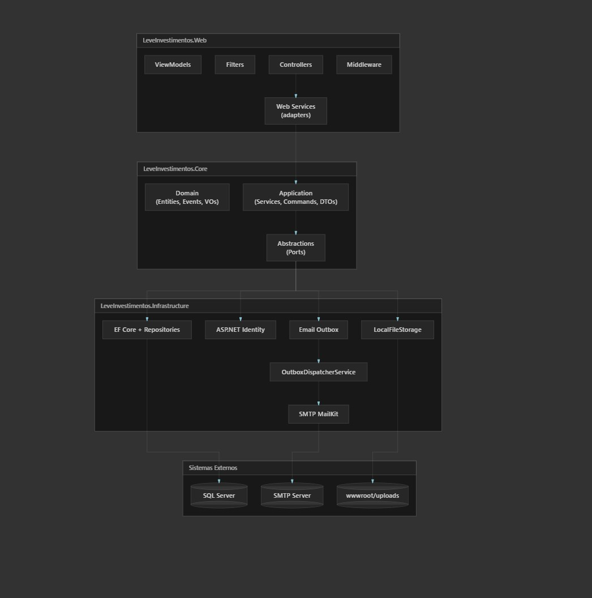
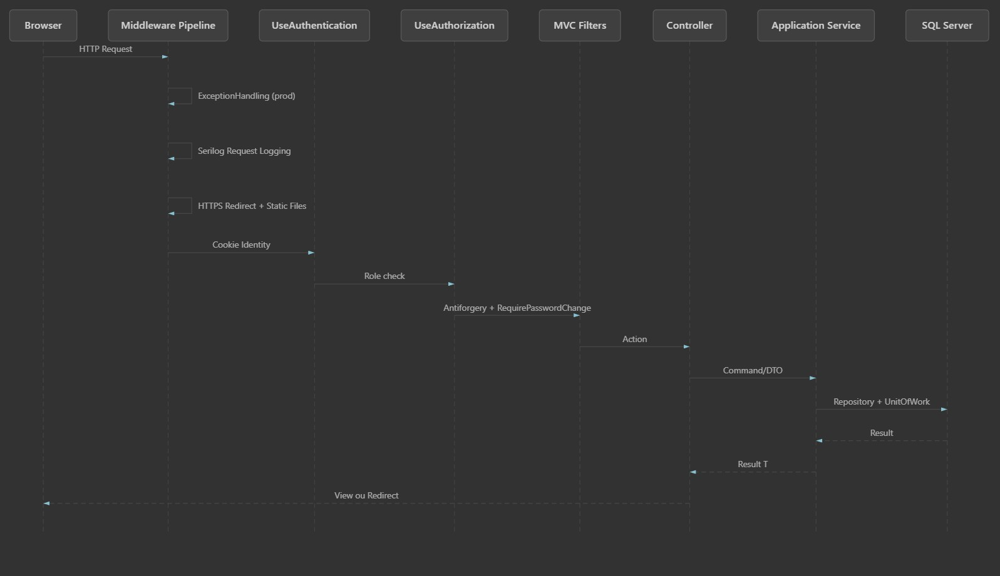

# LEVE Investimentos

Aplicacao ASP.NET Core MVC em .NET 10 para cadastro de usuarios, atribuicao de tarefas e notificacoes por e-mail via Outbox.

## Banco de dados local com Docker

O projeto usa SQL Server. Para subir o banco local pelo Docker Desktop no Windows, execute na raiz do repositorio:

```powershell
docker compose up -d
```

Se o seu terminal nao reconhecer `docker compose`, use o comando legado:

```powershell
docker-compose up -d
```

Depois que o container estiver em execucao, aplique as migrations:

```powershell
dotnet tool install dotnet-ef --tool-path .tools --version 10.0.8
$env:ASPNETCORE_ENVIRONMENT='Development'
.\.tools\dotnet-ef database update --project src\LeveInvestimentos.Infrastructure\LeveInvestimentos.Infrastructure.csproj --startup-project src\LeveInvestimentos.Web\LeveInvestimentos.Web.csproj
```

Para rodar a aplicacao:

```powershell
dotnet run --project src\LeveInvestimentos.Web\LeveInvestimentos.Web.csproj
```

## Primeiro Acesso

E-mail: ti@leveinvestimentos.com.br
Senha: teste123

## Arquitetura em Camadas



## Pipeline HTTP (toda requisição)



